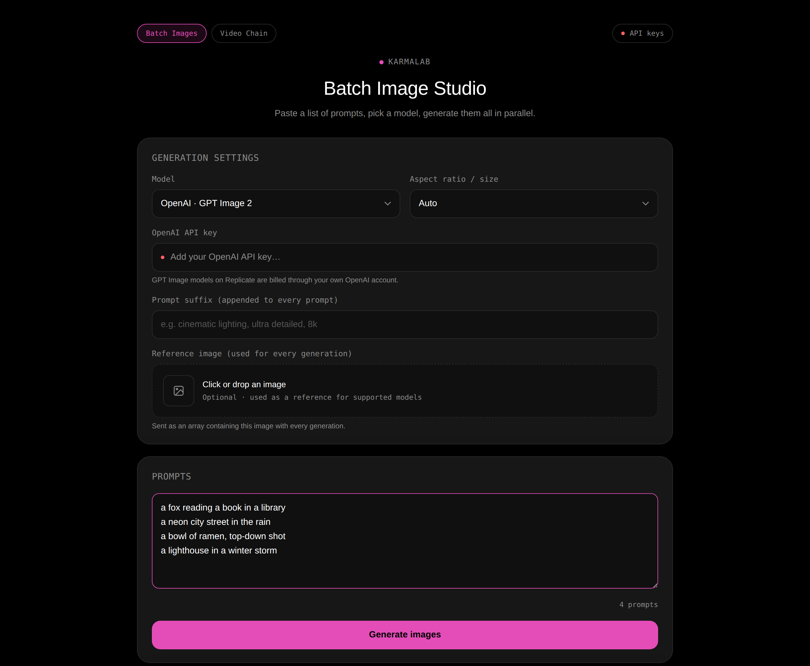
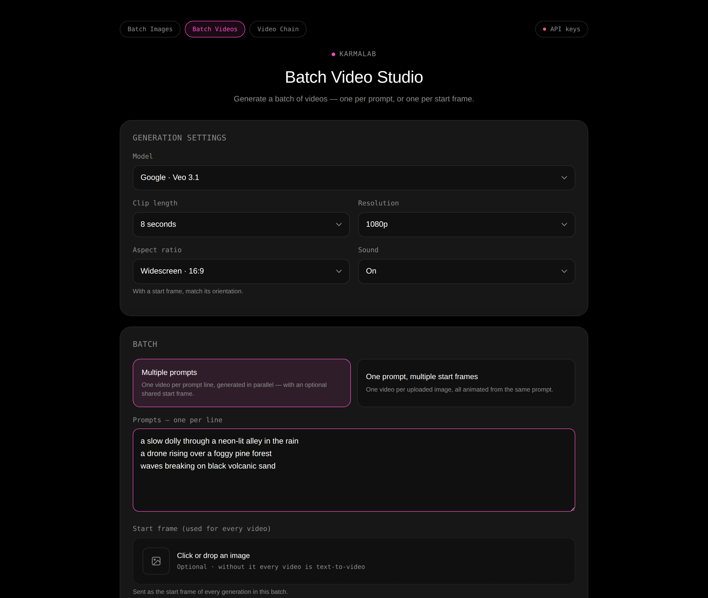
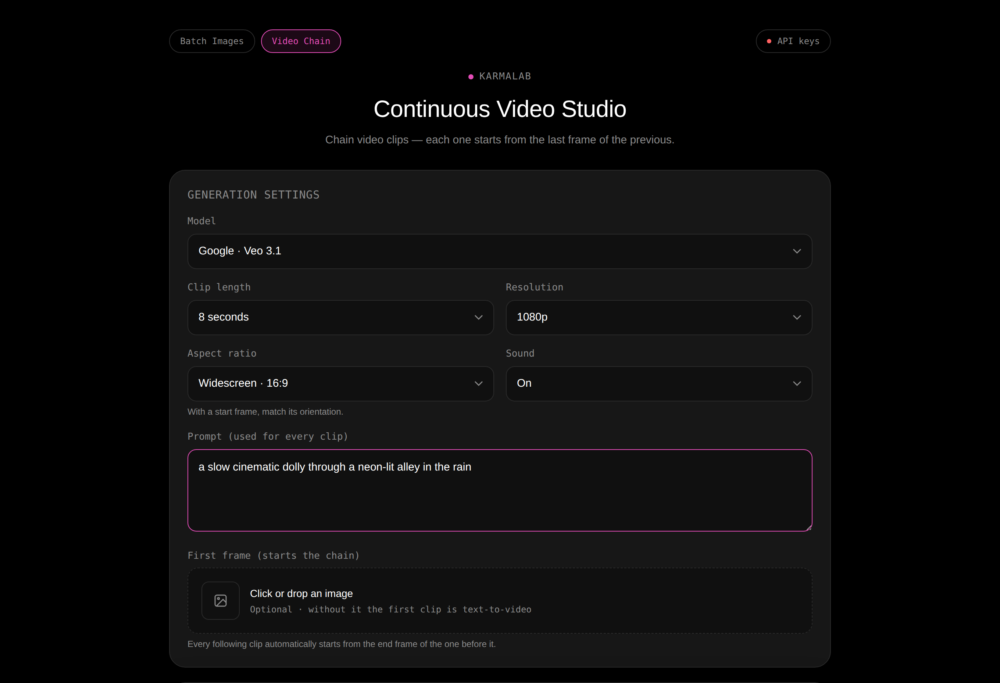

# KarmaLab Tools

A small collection of browser-based tools for generating images and video with
[Replicate](https://replicate.com) models. Each tool lives on its own route,
built with **React + Vite** and served by a tiny Node server that also proxies
the Replicate API.

Built for [KarmaLab](https://www.karmalab.tech) and open-sourced because the
tools are generally useful: if you work with Replicate models in bulk, or want
to chain video clips into a continuous shot, these do that without a signup.



## You bring your own keys — and pay for your own generations

There is no account and no server-side API key. You paste your own Replicate API
token into the app; it is kept in your browser's `localStorage` and sent with
each request. **Every generation is billed to your own Replicate account**, at
whatever that model costs. A few models (the OpenAI GPT Image ones) additionally
bill through your own OpenAI account and need an OpenAI key too.

Nothing is stored server-side — no accounts, no tokens, no prompts, no outputs.

## The tools

### Batch Image Studio — `/`

Paste a list of prompts, one per line, pick a model, and generate them all.
Runs up to three at a time, appends an optional shared suffix to every prompt,
takes an optional reference image, and downloads results individually or as a
zip. In-flight generations are remembered, so closing the tab and coming back
picks the run up where it left off.

Models: OpenAI GPT Image 1 and 2, Flux 1.1 Pro, Flux Kontext Pro, Ideogram v3
Turbo, Recraft v3, Stable Diffusion 3.5 Large.

### Batch Video Studio — `/batch-videos`



The same idea as the image studio, for video, in two modes: **one video per
prompt line** (with an optional start frame shared by all of them), or **one
video per uploaded start frame**, all animated from a single prompt. Both modes
run in parallel and download individually or as a zip.

Models: Veo 3.1 and 3.1 Fast, Kling v3, Seedance 2.0, Hailuo 2.3 Fast, Wan 2.7
i2v.

### Continuous Video Studio — `/video-chain`



Chains video clips into one continuous shot: each clip is generated from the
**last frame of the previous one**, extracted in the browser with an off-screen
`<video>` and a canvas. Start from a text prompt or a first frame, then either
auto-run a set number of clips or review each one and choose to continue, retry,
or stop.

Models: the same catalogue as the Batch Video Studio — both video tools read
`src/shared/videoModels.js`.

### Prompt Box — `/prompt`

A **non-functional UI mockup** of a prompt box. It generates nothing and calls
nothing — it exists as a styling reference. Mentioned here so its presence in the
repo isn't a mystery.

## Running it locally

Needs **Node ≥ 18.11** (`.nvmrc` pins 20) and **yarn** — the lockfile is
`yarn.lock`, so npm will produce a different dependency tree.

```bash
yarn install
yarn dev        # Vite dev server with HMR at http://localhost:5173
```

Then open http://localhost:5173, click **API keys** in the top bar, and paste a
Replicate token from
[replicate.com/account/api-tokens](https://replicate.com/account/api-tokens).

To run the production setup instead — the built app served by the Node server:

```bash
yarn build
yarn start      # http://localhost:8787
```

Other scripts:

```bash
yarn lint          # ESLint
yarn format        # Prettier, write
yarn format:check  # Prettier, check only (what CI runs)
yarn test          # Vitest
```

## How it works

Each tool is a separate Vite HTML entry with its own bundle — there is no
client-side router, so the heavy Batch Studio JavaScript never loads on the
Prompt Box. Routing lives on the server: `server/routes.js` maps clean routes to
built HTML files.

`api.replicate.com` sends no CORS headers, so the browser cannot call it
directly. Both the Vite dev server and the Node production server forward
`/v1/...` to Replicate, keeping every call same-origin.

See [docs/ARCHITECTURE.md](docs/ARCHITECTURE.md) for the full picture, including
the design-token setup and what is deliberately not built.

## A note on the Replicate proxy

Because the token comes from the browser, the `/v1` proxy is usable by anyone who
can reach a deployed instance. It exposes no credentials — callers supply their
own token and none is stored — but it does mean your host relays their traffic.
The proxy therefore forwards only the two request shapes the app itself makes,
only the headers Replicate needs, and only within a per-client rate limit. See
`server/proxy.js`.

**If you deploy this publicly, understand that tradeoff first.** The stronger
setup is to hold a Replicate token server-side and authenticate your own users
instead of accepting one from the browser. Found a hole? See
[SECURITY.md](SECURITY.md).

## Deploying

The repo ships a `Dockerfile` (multi-stage: build, then run the server) and a
`fly.toml` for [fly.io](https://fly.io). The `app` name in `fly.toml` is a
placeholder — fly.io app names are globally unique, so run `fly launch` to create
your own before `fly deploy`.

Any host that can run a Node container works; the runtime needs no
`node_modules` at all, since the server uses only Node core modules.

Environment variables:

| Variable                     | Default            | Purpose                                                                                                               |
| ---------------------------- | ------------------ | --------------------------------------------------------------------------------------------------------------------- |
| `PORT`                       | `8787`             | Port the server listens on (`fly.toml` sets `8080`)                                                                   |
| `PROXY_MAX_BODY_BYTES`       | `25165824` (24 MB) | Max proxied request body — reference images are base64 and not downscaled                                             |
| `PROXY_RATE_LIMIT_MAX`       | `300`              | Proxied requests allowed per client per window                                                                        |
| `PROXY_RATE_LIMIT_WINDOW_MS` | `60000`            | Rate-limit window                                                                                                     |
| `TRUST_PROXY_HEADER`         | unset              | Set only behind a proxy that overwrites `X-Forwarded-For`; otherwise clients could forge it to reset their rate limit |

## Contributing

Contributions are welcome — adding a model is a one-line change, and adding a
whole tool is three. See [CONTRIBUTING.md](CONTRIBUTING.md).

## License

[MIT](LICENSE).
